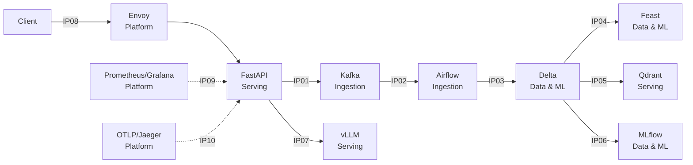

# Kiến trúc và phân quyền sở hữu — Day 28 Track 2

## Phân quyền theo integration point

| ID | Boundary | Owner | Đầu ra/bằng chứng bắt buộc |
|---|---|---|---|
| IP01 | HTTP ingestion → Kafka | Ingestion & Orchestration | Event, Kafka key và `traceparent` |
| IP02 | Kafka → Airflow 3 | Ingestion & Orchestration | DAG run, task state và asset event |
| IP03 | Airflow/Spark → Delta | Data & ML | MERGE history, schema và time travel |
| IP04 | Delta → Feast | Data & ML | Online entity, Delta version và freshness |
| IP05 | Delta documents → Qdrant | Serving & Retrieval | Deterministic point ID, `doc_id` và score |
| IP06 | Evaluation → MLflow Registry | Data & ML | Artifact, signature, tag, provenance và alias `champion` |
| IP07 | RAG prompt → vLLM thật | Serving & Retrieval | vLLM identity, model ID và metric `vllm:` |
| IP08 | Client → Envoy gateway | Platform & Observability | Route, `x-request-id`, phản hồi 200 và 429 |
| IP09 | Components → Prometheus/Grafana | Platform & Observability | Target, dashboard, golden signals và cảnh báo SLO |
| IP10 | Components → OTLP trace | Platform & Observability | Một trace ID chứa đủ các span bắt buộc |

Presenter/Incident Commander chịu trách nhiệm sắp xếp demo, lập chỉ mục evidence,
điều phối tình huống sự cố và trả lời Q&A. Khi làm cá nhân, Nguyễn Công Đạt đảm
nhận đồng thời tất cả các vai trò nhưng vẫn giữ nguyên owner kỹ thuật của từng
boundary để chẩn đoán đúng thành phần.

## Luồng sở hữu khi có sự cố

Nguồn chuẩn để kiểm tra tên boundary, test, readiness check và evidence là
`contracts/integration-matrix.yaml`. Sơ đồ này không thay thế bằng chứng live;
mỗi IP chỉ được đánh dấu đạt khi có đúng tệp evidence và ID/version tương ứng.
